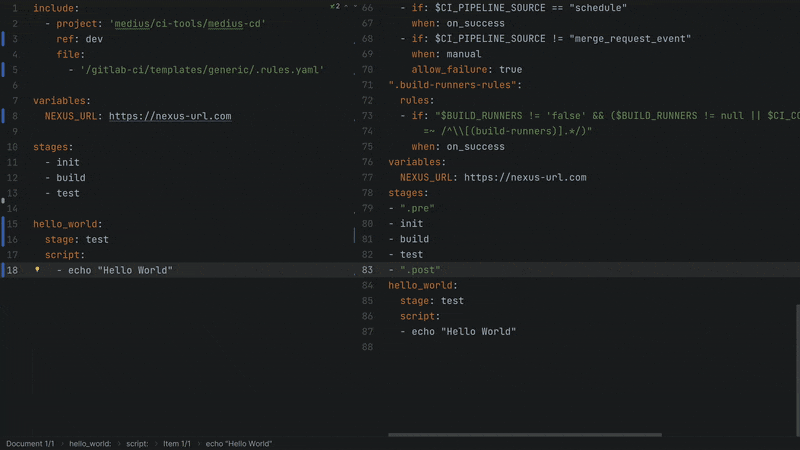

    

<h1 align="center">Gitlab Template Lint</h1>

Gitlab Template Lint for IntelliJ based IDEs/Android Studio.

 

- [Description](#description)
- [Features](#features)
- [Compatibility](#compatibility)
- [Install](#install)
- [Installation from zip](#installation-from-zip)
- [Demo](#demo)

## Description
Gitlab Template Lint Plugin is a plugin for IntelliJ based IDEs/Android studio for linting
Gitlab CI/CD yaml configuration files. It uses the Gitlab lint API to check the currently
open yaml configuration and shows the errors in the notification bar.

To get started, install the plugin and set Gitlab private token with <kbd>read_api</kbd> and <kbd>api</kbd> scope in plugin's settings:
<kbd>Settings</kbd> > <kbd>Tools</kbd> > <kbd>Gitlab Template Lint</kbd>

## Features
- Linting of Gitlab CI/CD yaml configuration files
- Preview of the merged Gitlab CI/CD yaml configuration files

## Compatibility
IntelliJ IDEA, PhpStorm, WebStorm, PyCharm, RubyMine, AppCode, CLion, GoLand, DataGrip, Rider, MPS, Android Studio, DataSpell, Code With Me

## Install

Or you could install it inside your IDE:

For Windows & Linux: <kbd>File</kbd> > <kbd>Settings</kbd> > <kbd>Plugins</kbd> > <kbd>Marketplace</kbd> > <kbd>Search for "Gitlab Template Lint"</kbd> > <kbd>Install Plugin</kbd> > <kbd>Restart IntelliJ IDEA</kbd>

For Mac: <kbd>IntelliJ IDEA</kbd> > <kbd>Preferences</kbd> > <kbd>Plugins</kbd> > <kbd>Marketplace</kbd> > <kbd>Search for "Gitlab Template Lint"</kbd> > <kbd>Install Plugin</kbd>  > <kbd>Restart IntelliJ IDEA</kbd>

## Installation from zip
1. Download zip from [releases](https://github.com/Blarc/gitlab-lint-plugin/releases)
2. Import to IntelliJ: <kbd>Settings</kbd> > <kbd>Plugins</kbd> > <kbd>Cog</kbd> > <kbd>Install plugin from disk...</kbd>
3. Set Gitlab private token in plugin's settings: <kbd>Settings</kbd> > <kbd>Tools</kbd> > <kbd>Gitlab Template Lint</kbd>

## Demo

## Support

* Star the repository
* [Rate the plugin](https://plugins.jetbrains.com/plugin/19411-gitlab-template-lint)
* [Share the plugin](https://plugins.jetbrains.com/plugin/19411-gitlab-template-lint)
* [Buy me a coffee](https://ko-fi.com/blarc)

## Change log

Please see [CHANGELOG](CHANGELOG.md) for more information what has changed recently.

## Contributing

Please see [CONTRIBUTING](CONTRIBUTING.md) for details.

## License

Please see [LICENSE](LICENSE) for details.
